### Hi, I'm MIXYANG

I'm a grad student at the School of Artificial Intelligence, Guangzhou University. I work on agent infra and agent harnesses, and write the backend services that agents run on, mostly in Go.

You can reach me at ruixingxingxing@gmail.com.
